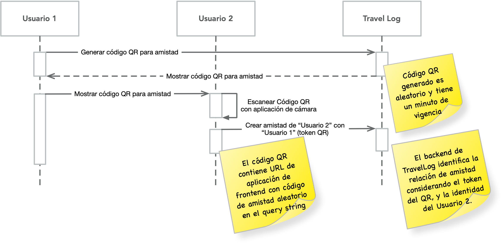

**Nombres de integrantes del grupo:** (completar aquí)

# Proyecto 1.5 - Intermodalidad, sensibilidad al contexto y tiempo real

El contexto del usuario móvil es un constructo complejo que abarca múltiples variables: tiempo, ubicación geográfica, la tarea que el usuario realiza y el estado de la tarea, la interacción social (mediada por el software, y/o cara a cara), etc. Hemos visto en el curso cómo el espacio físico puede ser mejorado con ciertos dispositivos (_beacons_ BLE) o incluso medios analógicos (p.ej., papel impreso con códigos QR) que proveen información contextual a la aplicación móvil, en forma automática y transparente (_beacons_) o requiriendo al usuario una interacción mínima (NFC, códigos QR).

En esta última entrega de proyecto, el objetivo es completar ciertas funciones de la aplicación Travel Log que se relacionan con lo anterior:

1. [2.0; escala 1-10] Que un usuario pueda agregar a otro como amigo/compañero de viaje, y pueda quedar registrado el momento y el lugar en donde ocurre esta acción. Esta acción se podrá realizar generando y escaneando un código QR, similar a cómo lo hacen aplicaciones como WhatsApp.
2. [1.0; escala 1-5] Que el usuario pueda contar con un perfil y agregar en éste su foto de perfil (avatar).
3. [2.0; escala 1-5] Que el usuario pueda agregar a un post fotografías [.5], que las fotografías aparezcan desplegadas en el post [.5] en formato de galería adecuado para pantalla de dispositivo móvil [.5], y que se puedan ver individualmente, ampliadas [.5].
4. [1.0; escala 1-3] Además, la aplicación deberá ser puesta en operación en una plataforma o nube pública, sobre todo para hacer funcionar el uso de códigos QR.

A continuación entregamos ciertas indiaciones y recomendaciones sobre cómo desarrollar lo anterior.

## Compañeros de Viaje

Cada usuario de Travel Log puede tener compañeros de viaje y agregarlos mediante el proceso en la siguente figura. Suponiendo que hay dos usuarios, 1 y 2, el Usuario 1 genera en Travel Log un código QR para amistad que luego muestra al Usuario 2. El Usuario 2 escanea el código (que tiene vigencia de 60 segundos) y luego de esto Travel Log automáticamente crea la relación de amistad entre los dos usuarios. Si el código expira, el Usuario 1 puede volver a generarlo y el proceso se repite. El Usuario 2 ve un mensaje de error si escanea un código expirado. 

El escaneo del código se hace con la aplicación de cámara del teléfono (o aplicación de escaner de códigos QR), es decir, no se pide implementar la funcionalidad de escaneo en la aplicación de _frontend_ en React. El código QR debe contener la URL del _frontend_ de Travel Log, con un código aleatorio en una variable del _query string_ (p.ej, `fndtk` - _friendship token_). La aplicación React recupera el _friendship token_ y luego lo envía al _backend_ para que procese la solicitud de amistad. La llamada al _backend_ debe contener `fndtk`, y la ubicación actual (de acuerdo a lo visto en el proyecto 1.4) del usuario. 



### Recuperación de variables de query strings en aplicación React

El componente `react-router-dom` provee un hook llamado `useLocation`. A través de este hook se puede acceder a las variables de query string en la URL actual. Además, se puede adjuntar un hook de efecto que actúe cada vez que la URL (y las variables de query string) cambian. El siguiente código ilustra cómo se implementa este comportamiento:

```javascript
import { useLocation } from "react-router-dom";

function FriendshipTokenHandler() {
    const location = useLocation();

    useEffect(() => {
        const queryParams = new URLSearchParams(location.search);
        const friendshipToken = queryParams.get('friendshipToken');
        
        if (friendshipToken) {
            // Enviar el token al backend para crear relación de amistad
        }
    }, [location.search]);
}
```

### Generación de código QR

El código QR con información de _friendship token_ deberá ser generado por el backend de Travel Log. Puedes definir `FriendshipToken` como un recurso singleton (es decir, sin `id`) en `routes.rb`. Luego, necesitas crear un controlador `FriendshipTokensController` que a través de la acción `show` genere un código QR de amistad para el usuario que llama al _endpoint_. 

Para generar el código QR, puedes usar el gem llamado [rqrcode](https://github.com/whomwah/rqrcode) (encuentra en la documentación el método `as_png`). Además, necesitarás incluir la gem llamada `chunky_png` para generar la imagen PNG. 

La acción `FriendshipTokensController::show` tendría que llamar a `as_png` de la siguiente manera:

```ruby
    send_data RQRCode::QRCode.new(url_de_frontend_con_fndtk_en_query_string).as_png(size: 300), type: 'image/png', disposition: 'attachment'
```

Con lo anterior, la aplicación de frontend puede descargar la imagen PNG con el código QR y desplegarla para que el Usuario 2 la escanee.

## Toma de fotografía de avatar

La toma de fotografía de avatar se puede realizar en la aplicación de _frontend_ React de manera simple invocando la aplicación de cámara externa desde un elemento de formulario de tipo `input`:

```html
<input type="file" accept="capture=camera,image/*">
```

Sin embargo, se puede dar una mejor experiencia al usuario sin requerir un cambio de aplicación si se opta por acceder a la cámara desde el propio navegador web. Existen para React numerosos ejemplos sobre cómo hace una captura de imagen en el navegador web desde una aplicación React - [aquí les dejo uno completo](https://codesandbox.io/s/react-camera-api-image-capture-forked-qxp3yy). La API web estándar subyacente es la de [navigator.mediaDevices](https://developer.mozilla.org/en-US/docs/Web/API/Navigator/mediaDevices).

## Subidas de archivos de imagen a la aplicación de backend de Travel Log

Las subidas de fotografías al backend de la aplicación TravelLog se deben realizar utilizando [Active Storage](https://guides.rubyonrails.org/active_storage_overview.html) de Rails. La aplicación de _backend_ de Travel Log ya incorpora un modelo de `Media` (con archivo adjunto), y `Photo` (derivado de `Media`). Pueden realizar cambios a este diseño si lo estiman necesario.

## Despliegue de aplicación en sitios públicos


## Forma de Trabajo


## Informar aquí problemas conocidos o limitaciones


